# Architecture Overview

This document describes the architecture of the Yemen Property Rental Platform.

## System Architecture

**Note:** The architecture diagram image (`/docs/images/architecture-diagram.png`) reference needs to be created. This should be generated from the mermaid diagram for a visual representation of the system architecture.


The application follows a modern Next.js architecture with React components, API routes, and database integration.

## Logical Architecture Diagram

```mermaid
graph TD
    subgraph "Client Layer"
        A[User Interface] --> B[React Components]
        B --> C1[UI Components]
        B --> C2[Listing Components]
        B --> C3[Input Components]
        B --> C4[Navbar Components]
        B --> C5[Modal Components]
        
        D[State Management] --> E1[Custom Hooks]
        E1 --> E2[useLoginModal]
        E1 --> E3[useRegisterModal]
        E1 --> E4[useRentModal]
        E1 --> E5[useSearchModal]
        E1 --> E6[useFavorite]
        E1 --> E7[useCountries]
        
        F[Providers] --> F1[ModalsProvider]
        F --> F2[ToasterProvider]
    end
    
    subgraph "Server Layer"
        G[Next.js App Router] --> H1[Page Components]
        H1 --> H2[Home Page]
        H1 --> H3[Listings Pages]
        H1 --> H4[Trips Pages]
        H1 --> H5[Reservations Pages]
        H1 --> H6[Favorites Pages]
        H1 --> H7[Properties Pages]
        
        I[Server Components] --> I1[Error Handling]
        I --> I2[Loading States]
        
        J[API Routes] --> J1[/api/listings]
        J --> J2[/api/reservations]
        J --> J3[/api/favorites]
        J --> J4[/api/views]
        J --> J5[/api/register]
        
        K[Server Actions] --> K1[getCurrentUser]
        K --> K2[getListings]
        K --> K3[getListingById]
        K --> K4[getFavoriteListings]
        K --> K5[getReservations]
        
        L[Authentication] --> L1[NextAuth.js]
        L1 --> L2[OAuth Providers]
        L1 --> L3[Credentials Auth]
    end
    
    subgraph "Data Layer"
        M[Type Definitions] --> M1[app/types]
        
        N[Prisma ORM] --> N1[schema.prisma]
        N1 --> O[MongoDB]
        
        O --> P1[Users]
        O --> P2[Accounts]
        O --> P3[Listings]
        O --> P4[ListingImages]
        O --> P5[Reservations]
    end
    
    %% Connections between layers
    C1 <--> E1
    C2 <--> E1
    E1 <--> L1
    H1 <--> K
    J <--> N
    K <--> N
    F1 --> C5
    
    %% Styling
    classDef primary fill:#f9f,stroke:#333,stroke-width:2px
    classDef secondary fill:#bbf,stroke:#333,stroke-width:2px
    classDef tertiary fill:#bfb,stroke:#333,stroke-width:2px
    
    class A,G,O primary
    class B,D,F,I,J,K,L,N secondary
    class C1,C2,C3,C4,C5,E1,H1,M tertiary
```

## Key Components

### Frontend

- **Next.js App Router**: Routes and renders pages
- **React Components**: UI building blocks
- **Zustand Stores**: State management for modals and UI state
- **React Query/SWR**: Data fetching and caching
- **TypeScript**: Type safety throughout the application

### Backend

- **Next.js API Routes**: Serverless API endpoints
- **NextAuth.js**: Authentication system
- **Prisma ORM**: Database access layer
- **Middleware**: Request processing and validation

### Database

- **MongoDB**: Document database
- **Collections**:
  - Users
  - Accounts (OAuth)
  - Listings
  - ListingImages
  - Reservations

## Data Flow

1. **User Interaction** → Client-side React components
2. **Data Fetching** → API routes or Server Components
3. **Data Persistence** → Prisma ORM → MongoDB
4. **Authentication** → NextAuth.js → Database

## Directory Structure

```
├── app/
│   ├── actions/          # Server actions for data fetching
│   ├── api/              # API routes
│   │   ├── auth/         # Authentication endpoints
│   │   ├── favorites/    # Favorites management
│   │   ├── listings/     # Listing CRUD operations
│   │   ├── register/     # User registration
│   │   ├── reservations/ # Reservation management
│   │   └── views/        # View counter functionality
│   ├── components/       # React components
│   │   ├── inputs/       # Form input components
│   │   ├── listings/     # Listing-related components
│   │   ├── modals/       # Modal dialog components
│   │   └── navbar/       # Navigation components
│   ├── favorites/        # Favorites page
│   ├── hooks/            # Custom React hooks
│   ├── libs/             # Utility libraries
│   ├── listings/         # Listing pages
│   ├── providers/        # Context providers
│   ├── reservations/     # Reservation pages
│   ├── trips/            # User trips page
│   ├── types/            # TypeScript definitions
│   ├── layout.tsx        # Root layout
│   └── page.tsx          # Home page
├── pages/
│   └── api/
│       └── auth/         # NextAuth API routes
├── prisma/
│   └── schema.prisma     # Database schema
└── public/               # Static assets
```

## User Flow Diagrams

### Authentication Flow

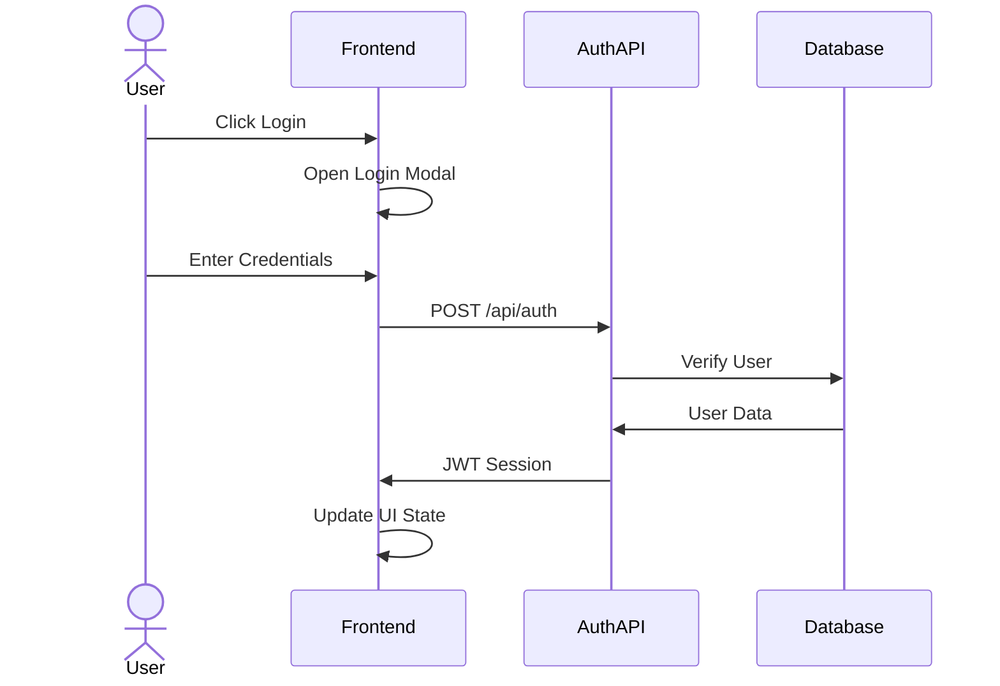

### Listing Creation Flow

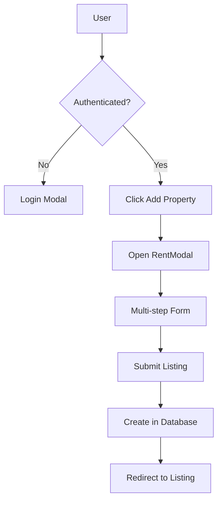

## Performance Considerations

- Server Components for data-heavy pages
- Client Components for interactive elements
- Image optimization with Next.js Image component
- Pagination for listing results
- Optimistic UI updates for better user experience

## Security Measures

- NextAuth.js for secure authentication
- Password hashing with bcrypt
- JWT session management
- Prisma for type-safe database queries
- Input validation on API endpoints
- Owner verification for sensitive operations 

## Architecture Diagram Update Notes

The Logical Architecture Diagram has been updated to accurately reflect the current codebase structure with the following improvements:

1. **Enhanced Client Layer**
   - Added detailed component breakdown (UI, Listing, Input, Navbar, Modal components)
   - Specified custom hooks used for state management (useLoginModal, useRegisterModal, etc.)
   - Added providers section showing ModalsProvider and ToasterProvider

2. **Expanded Server Layer**
   - Detailed page components and their organization
   - Added comprehensive API routes structure
   - Included Server Actions with specific action names
   - Enhanced authentication representation with OAuth and credentials providers

3. **Improved Data Layer**
   - Added type definitions reference
   - Expanded database collections structure
   - Clarified relationship between Prisma schema and MongoDB

4. **Connection Clarity**
   - Added explicit connections between components across layers
   - Used styling to differentiate primary, secondary, and tertiary components
   - Improved visual hierarchy for better readability

This diagram now provides a more accurate representation of how the application components interact, making it a valuable reference for both new and existing developers.

## Detailed Subsystem Diagrams

### Reservation System Workflow

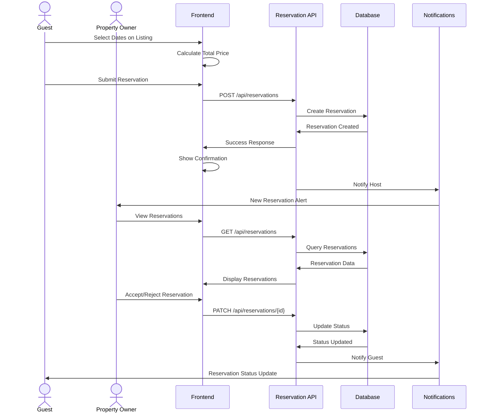

### Property Listing Subsystem

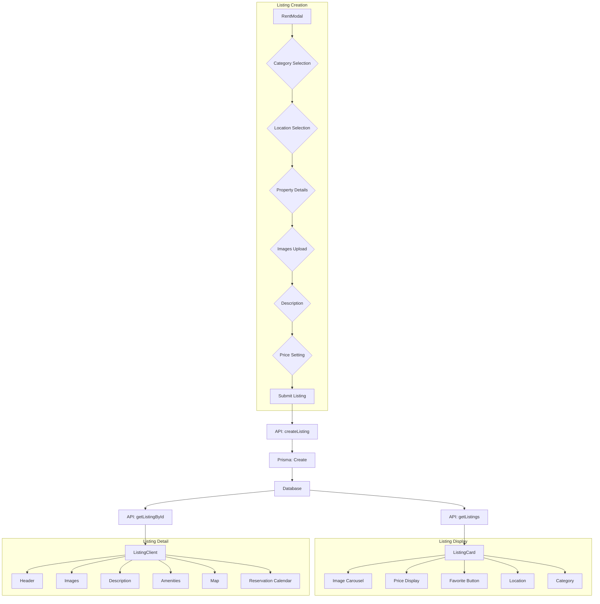

### Authentication System Detail

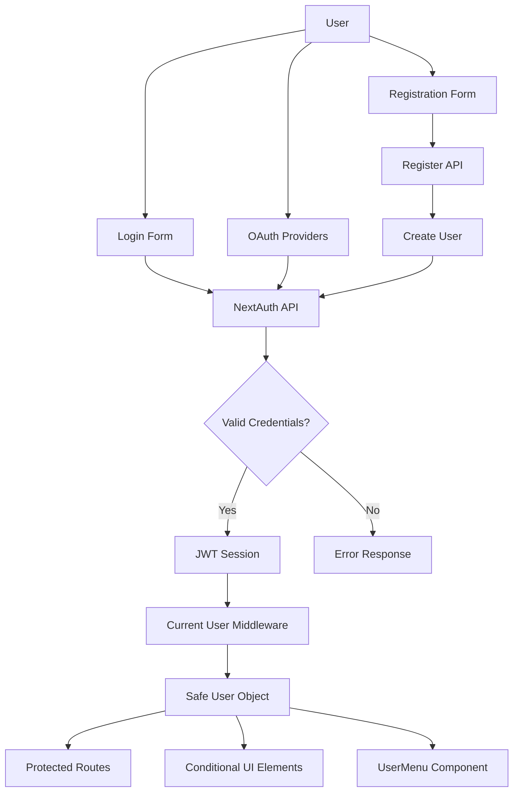

### State Management with Zustand

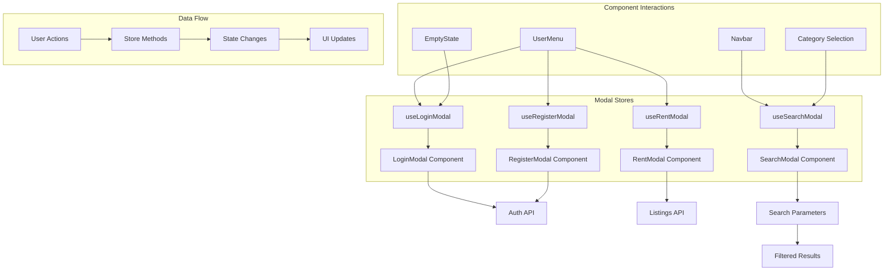

### Search & Filtering System

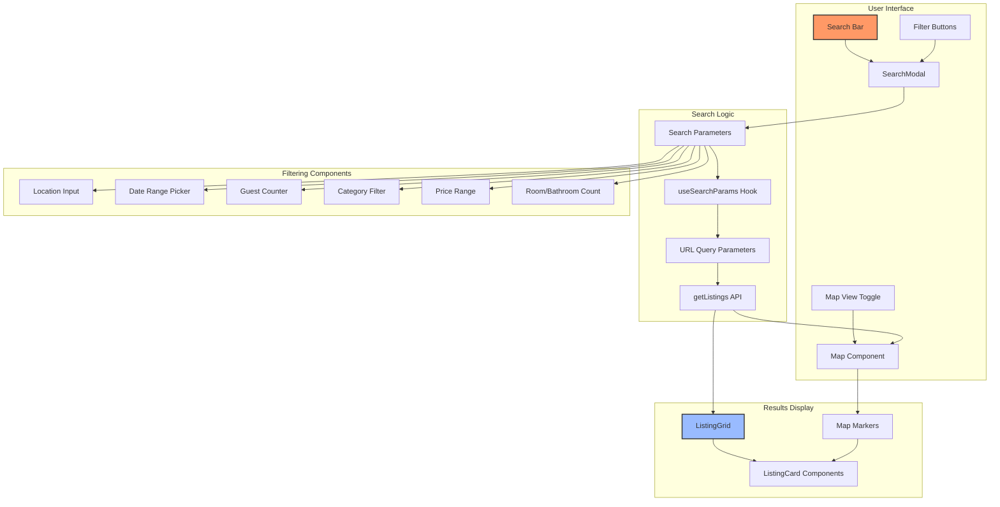

### Favorites System

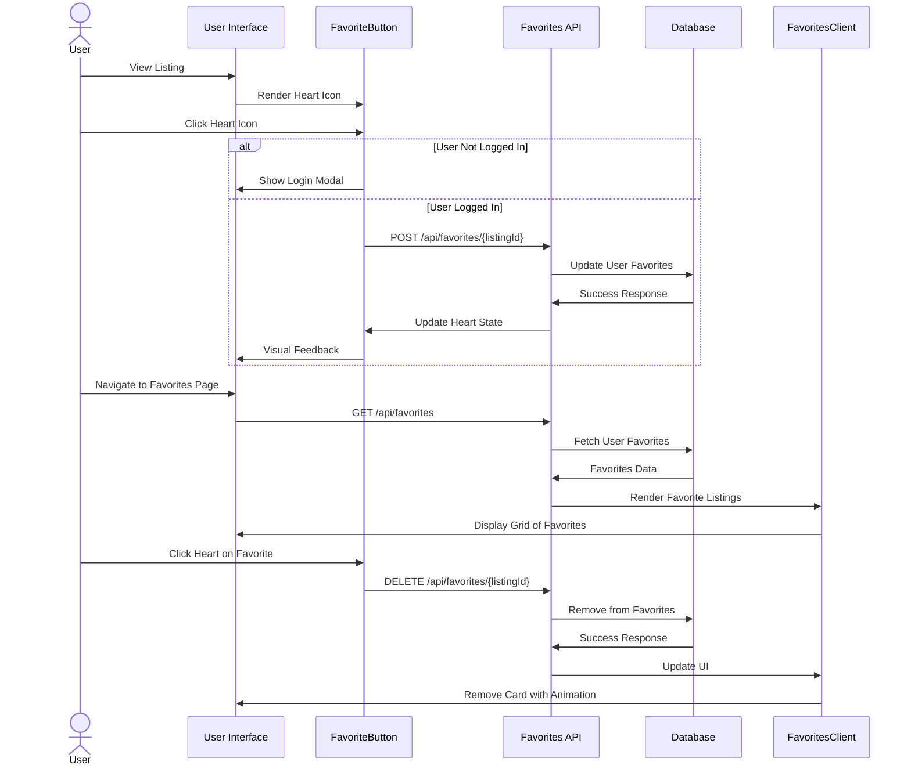

### User Profile & Properties Management

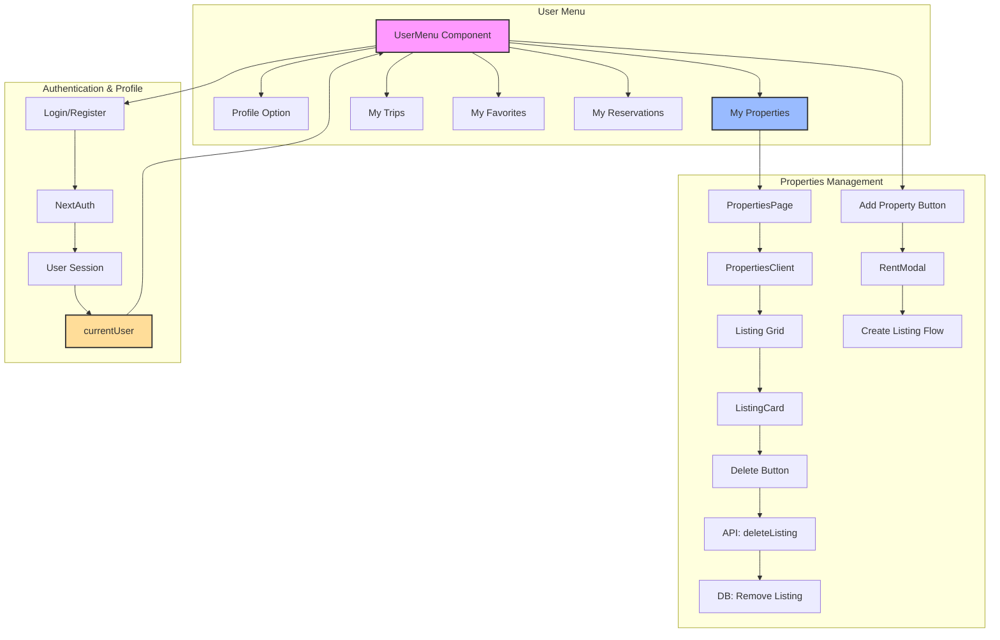

### Trip Management System

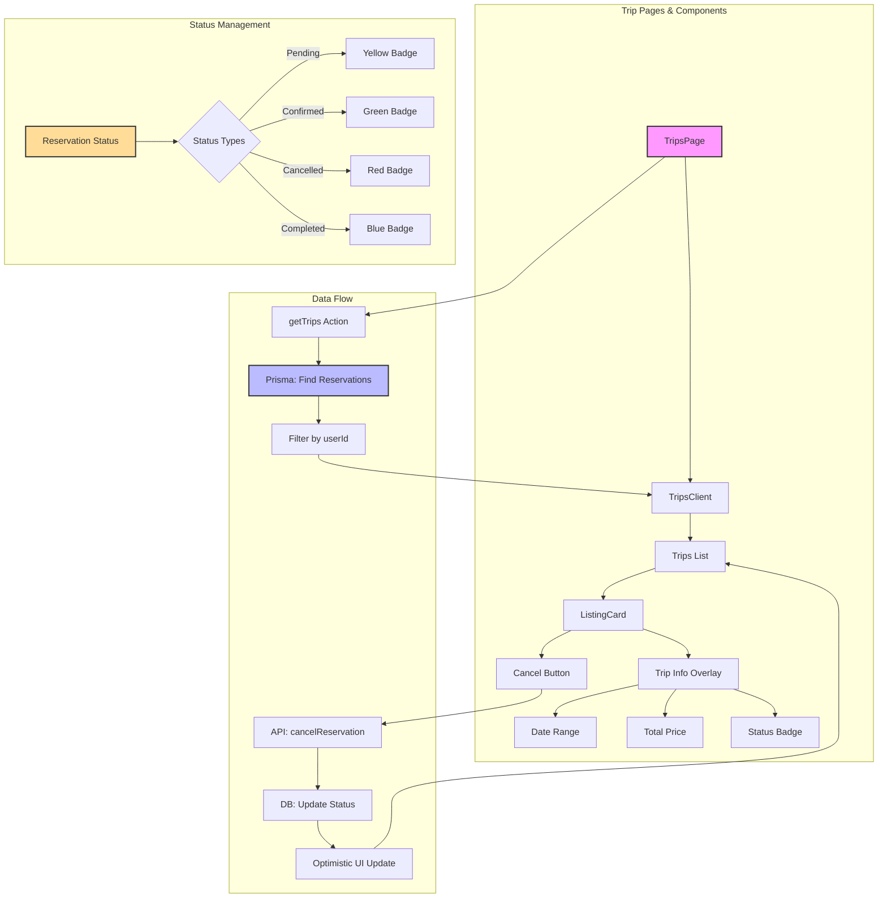

### Image Upload & Management System

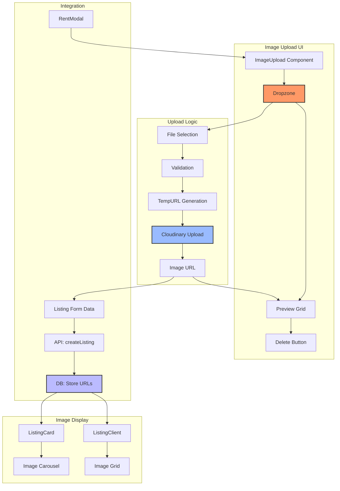

### API Middleware Pipeline

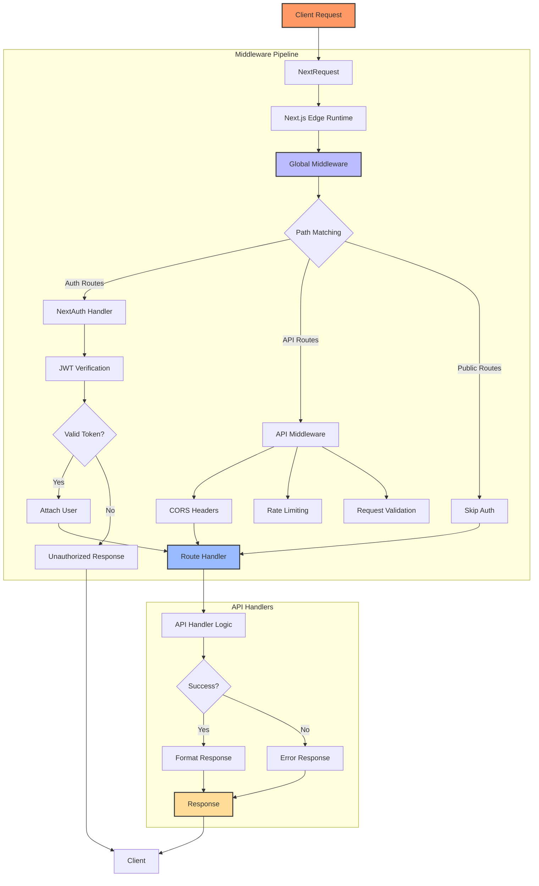

This diagram illustrates how API requests flow through the middleware pipeline:

1. Client requests enter the Next.js Edge Runtime
2. Global middleware processes all incoming requests
3. Path-specific middleware is applied based on route patterns
4. Authentication middleware verifies user sessions for protected routes
5. API middleware applies CORS headers, rate limiting, and request validation
6. Route handlers process the validated request
7. Responses are formatted and returned to the client 