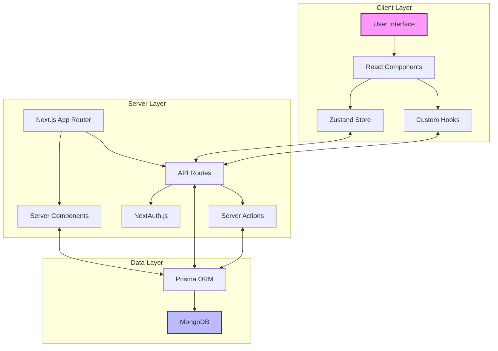
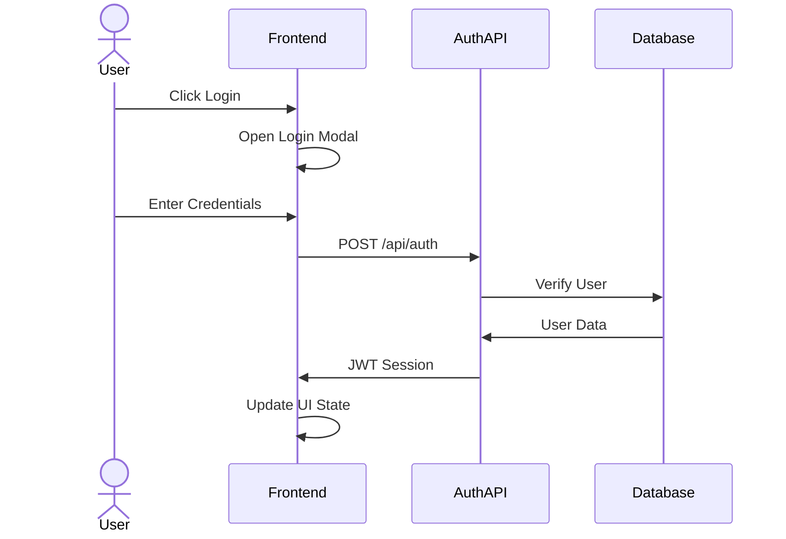
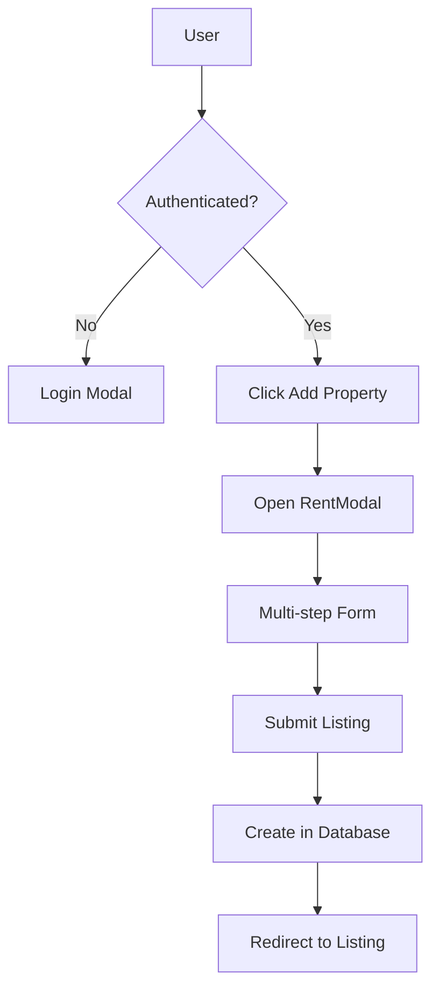

# Architecture Overview

This document describes the architecture of the Yemen Property Rental Platform.

## System Architecture


The application follows a modern Next.js architecture with React components, API routes, and database integration.

## Logical Architecture Diagram



## Key Components

### Frontend

- **Next.js App Router**: Routes and renders pages
- **React Components**: UI building blocks
- **Zustand Stores**: State management for modals and UI state
- **React Query/SWR**: Data fetching and caching
- **TypeScript**: Type safety throughout the application

### Backend

- **Next.js API Routes**: Serverless API endpoints
- **NextAuth.js**: Authentication system
- **Prisma ORM**: Database access layer
- **Middleware**: Request processing and validation

### Database

- **MongoDB**: Document database
- **Collections**:
  - Users
  - Accounts (OAuth)
  - Listings
  - ListingImages
  - Reservations

## Data Flow

1. **User Interaction** → Client-side React components
2. **Data Fetching** → API routes or Server Components
3. **Data Persistence** → Prisma ORM → MongoDB
4. **Authentication** → NextAuth.js → Database

## Directory Structure

```
├── app/
│   ├── actions/          # Server actions for data fetching
│   ├── api/              # API routes
│   │   ├── auth/         # Authentication endpoints
│   │   ├── favorites/    # Favorites management
│   │   ├── listings/     # Listing CRUD operations
│   │   ├── register/     # User registration
│   │   ├── reservations/ # Reservation management
│   │   └── views/        # View counter functionality
│   ├── components/       # React components
│   │   ├── inputs/       # Form input components
│   │   ├── listings/     # Listing-related components
│   │   ├── modals/       # Modal dialog components
│   │   └── navbar/       # Navigation components
│   ├── favorites/        # Favorites page
│   ├── hooks/            # Custom React hooks
│   ├── libs/             # Utility libraries
│   ├── listings/         # Listing pages
│   ├── providers/        # Context providers
│   ├── reservations/     # Reservation pages
│   ├── trips/            # User trips page
│   ├── types/            # TypeScript definitions
│   ├── layout.tsx        # Root layout
│   └── page.tsx          # Home page
├── pages/
│   └── api/
│       └── auth/         # NextAuth API routes
├── prisma/
│   └── schema.prisma     # Database schema
└── public/               # Static assets
```

## User Flow Diagrams

### Authentication Flow



### Listing Creation Flow



## Performance Considerations

- Server Components for data-heavy pages
- Client Components for interactive elements
- Image optimization with Next.js Image component
- Pagination for listing results
- Optimistic UI updates for better user experience

## Security Measures

- NextAuth.js for secure authentication
- Password hashing with bcrypt
- JWT session management
- Prisma for type-safe database queries
- Input validation on API endpoints
- Owner verification for sensitive operations 